# Our First Widget

In this chapter, we'll make our very first part together, the basic and not-at-all-useful part shown in Figure \ref{fig:simple-part-widget}. This part will allow us to experiment, making the part, breaking the part, and changing the part, all without the fear that we'll jeopardize project timelines or make unfixable errors. By chapter's end, you should know how to:

- Build a simple part
- Add that part into a drawing **TODO WRITE THIS**
- Modify the part without breaking it

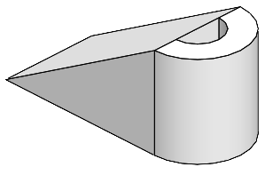

## Making a Triangle

Open \solidworks{} and create a new part using the default part template:

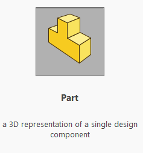

We are presented with a Feature Tree, menu tabs, working area, and potentially a few toolbars, as in Figure~\ref{fig:working-view}.

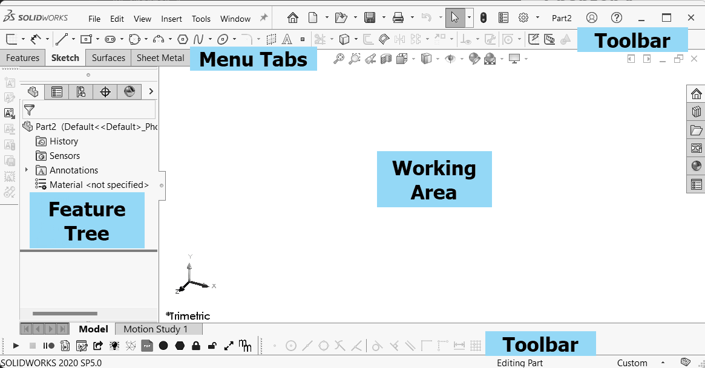

### A First Line

Our first task is to create the triangular cross-section. Start by creating a new \relation{Sketch}. As is often the case, we receive a helpful message in the sidebar:

This message indicates that we need to select a plane, for all 2-dimensional sketches live on a plane. The cursor also gains a filter to only select planes and surfaces \cadsymbol{cursor-select-plane-surface}. Choose the *Front Plane*.

When we open a new sketch, a few things change:

- Our view switches to *Normal*, or perpendicular, to the sketch plane.
- We gain access to Sketch tab and lose access to most of the Feature tab. The Sketch tab contains entities we can add to the sketch, such as \relation{Line} and \relation{Rectangle}.

Select the \relation{Line} tool and create a line in the working area. Holding the mouse over the Line tool displays a helper box describing how to use the tool:

### Basic Navigation & Orientation

With a single line created, we can more easily understand navigation around our working area. To better illustrate, I've drawn a square offset from the origin as in Figure~\ref{fig:starting-square}. No need to draw the square yourself.

Zoom within the working area by using the mouse scroll wheel. Alternatively, two-finger scroll on a touch pad, as you would on a webpage.

It is easy to get lost in space. If you find yourself zoomed too far in or out, use \relation{Zoom-to-Fit}, which centers the existing parts and entities within the screen.

Rotate the working area by click-holding the mouse center button and moving the mouse. Alternatively, use the arrow keys. I take advantage of both methods. The arrow keys are more controlled but also slower.

To return to one of the six cardinal views (*Front, Back, Top, Bottom, Right, Left*), use the Standard View menu. By default, these views are assigned to the hotkeys \texttt{Ctrl+1} through \texttt{Ctrl+6}.

To create a view that is looking straight at the current sketch plane (or to a selected plane), use \relation{Normal-To}, a fancy way of saying "perpendicular to".

### A First Sketch

Add two more lines to form a triangle, as in Figure~\ref{fig:first-sketch-triangle}. If something goes wrong, refer to Section~\ref{sec:fixing-sketches}.

As we sketch, alignment guides (Figure~\ref{fig:sketch-alignment-guides}) appear, say if we are vertically above the origin. The guides make it easier to create our sketch geometry, but sometimes they do things we don't want. If we want to over-ride their power, we can hold \texttt{Control} while we draw.

Relations (Figure~\ref{fig:sketch-alignment-guides}) sometimes appear beside the cursor when drawing lines. Yellow relations are added to the sketch, whereas white relations are merely "for your information". Relations will be discussed in Section~\ref{sec:}.

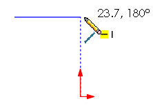

### Fixing Sketches Gone Awry
\label{sec:fixing-sketches}

If, even after *Zoom to Fit*, you're still disoriented, change perspective from the View toolbar. In a sketch, consider \relation{Normal-To}, a fancy way of saying "Perpendicular To". Outside of a sketch, consider \relation{Isometric}.

If you start a sketch entity in the wrong spot, \texttt{Esc} will close the sketch entity tool. If you've completed that entity, you can highlight it and \texttt{Delete}. Often (but not always), \texttt{Ctrl+Z} will undo the last addition to the sketch.

### Close and Rename Sketch

Once we have a triangle (any triangle), close the sketch \cadsymbol{close-sketch}. In our feature tree, we now have a sketch, probably called *(-) Sketch1*. Rename this sketch from *Sketch1* to *Triangle Sketch*. As in other Windows programs, rename itmes either via *click-pause-click* or by highlighting it and pressing \texttt{F2}.

### A First Feature

We will now turn the part from a 2D sketch into a 3D feature using Extrude[^pasta1]. Select \relation{Extrude} from the feature tab, select *Triangle Sketch*. Set the extrude distance to 1", as in Figure~\ref{fig:first-extrude-dialog}. If your default length units are anything besides inches, see Box~\ref{aside:part_units} to change them. Alternatively, leave them as they are. It's your part, after all.

[^pasta1]: As in pasta.

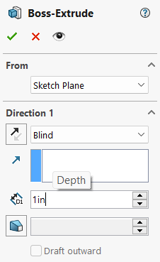

You should now have something that resembles Figure~\ref{fig:simple-widget-first-extrude}. Congratulations! You've made your first part. Because we aren't working in the cloud, now is a great time to \relation{Save}.

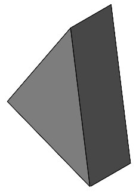

When choosing a part name, I recommend adopting a part numbering scheme. Throughout this book, I'll use the scheme in Figure~\ref{fig:part-numbering-scheme}, which makes this part *PRT-001 - Simple Widget*.

\begin{aside}
\label{aside:part_units}
\heading{Changing Part Units}

\noindent \solidworks{} plays well with most length units from small to large, provided the dimensions remain within the scale of manmade objects. \solidworks{}' units are defined in *Options > Document Properties > Units*.
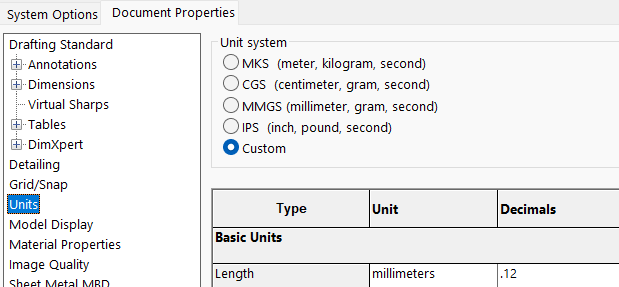

However, the easiest way to change the part's units are with the dropdown menu in the bottom-right of the working area. 

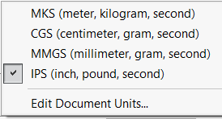

We will work in Imperial units (inch, pound, second) for this tutorial, not because I think it is better (I don't), but it is more confusing and will allow for more teaching opportunitites.

**Units of a Single Dimension**

Shoud you want to change the units of a single dimension, you can do so by overriding the units while editing the sketch. If you do this, I recommend modifying the *Dimension Text* to include the units.

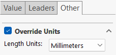

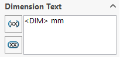

\end{aside}

## Modifying our Part

Throughout this chapter, we'll commit a number of poor CAD practices, for this will set us up for learning opportunities. We have committed the first already, so let's fix it.

The problem is that *Triangle Sketch* is under-defined, meaning our triangle is not defined to a certain size and shape. We can tell this because:

- The sketch entities (lines in this case) are highlighted blue.
- If we grab one of the triangles endpoints, we can move it.
- There is a (-) next to the sketch name.
- The "Under Defined" at the bottom of the sketch window.

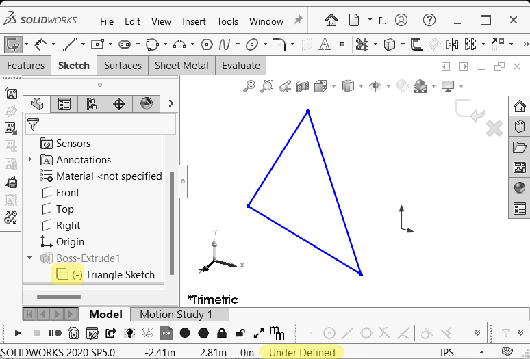

Under-defined sketches have fewer constraints than degrees of freedom. In simpler terms, this means that we can still move things around. We can see this by right-clicking *Triangle Sketch* and \relation{Edit-Sketch}. If you haven't already, drag and drop one vertex of our triangle to the sketch origin. Doing so creates a \relation{Coincident} relation between the origin and the vertex.

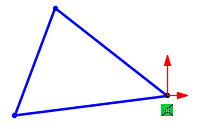

A three-step process is necessary to view the relations (which in this instance is academic, but will later be critical):

1. Edit the sketch if you aren't already. Relations are only visible while editing sketches.

2. Select the *Hide All Types* dropdown and select *View Sketch Relations*.
    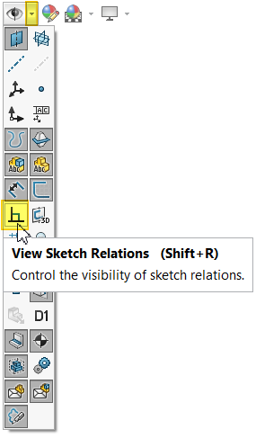

3. Confirm the *Hide All Types* eyeball is not depressed.
    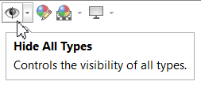

### What is a Relation?
There are two ways for us to specify the geometry of sketches. One is with dimensions (say 1" or 15\textdegree). Relations are ways for us to specify the geometry of sketches without the use of dimensions. One line, for instance, can be constrained \relation{Vertical} or \relation{Horizontal}. Two lines can be constrained \relation{Parallel} to each other, \relation{Perpendicular} to each other, \relation{Equal} in length, or along the same line (\relation{Collinear}). Each relation is represented by a symbol near the affected entities. A full table of \solidworks{} relations is shown in Appendix~\ref{app:relations}.

### From Triangle to Right Triangle

Next, we'll turn our triangle into a right triangle. First, add a horizontal relation to one leg by this process:

* Select one leg connected to the origin.
* Select \relation{Horizontal} in the *Line Properties* sidebar

Next, make the horizontal leg perpendicular to the other leg at the origin[^perpendicular] using a similar process:

* Select the horizontal leg and the other leg connected to the origin. See Box~\ref{aside:selection-strategies} for more help with selecting multiple entities.
* Select \relation{Perpendicular} from the *Properties* sidebar.

[^perpendicular]: Yes, a vertical relation on a single leg would suffice, but this allows for an extra teachable moment. In practice, a vertical relation would be perfectly acceptable.

We now have a right triangle. Both legs are constrained in orientation and they are no longer blue. However, their endpoints are blue, meaning we can change their length. Likewise, we can change the length and orientation of the hypotenuse, which is fully blue. We will now use dimensions to fully define our sketch.

### Adding Dimensions

Use the \kode{Smart} \relation{Dimension} tool to make the hypotenuse 2'' long.[^imperial-units] You could add this dimension in one of two ways:

1. Select the line.
1. Select both endpoints of the line.

For 95% of my needs, Option 1 is both simpler and more appropriate. I'll let you discover places to leverage Option 2 on your own.

[^imperial-units]: If you weren't born into a former British colony, my use of inches may be annoying. Feel free to substitute your favorite unit of length. \solidworks{} doesn't much care. Later exercises, where we use off-the-shelf hardware, won't be so foregiving.

Add an angular dimension between the horizontal leg and the hypotenuse in the same fashion. When the \relation{Dimension} tool is activated, we don't need to use \texttt{Ctrl} to multi-select. We can simply click on entities to select them, or use \texttt{Esc} to cancel the selection. Place the angular dimension inside the triangle to specify an interior angle and set that dimension to 30\textdegree.

Congratulations, our sketch is now fully defined, as noted in the bottom of the screen. Exit the sketch \cadsymbol{close-sketch}, and you will find that *Triangle Sketch* is no longer pre-fixed with *(-)*. The extrusion will automatically update. Now is a great time to \relation{Save}.

### Adding a Revolve

Extrudes are one of the most common features in part design, useful when we sweep a cross-sectional sketch along an axis perpendicular to that sketch[^sweep].
In our industrial world, many parts are rotationally symmetric. For those, we need the \relation{Revolve} feature. Let's add a revolve to the side of our existing widget.

[^sweep]: For non-perpendicular axes, we can use the \relation{Sweep} feature.

From our extrude, we get five new faces on which to sketch, in addition to the three cardinal planes (*Front*, *Top*, and *Right*). Select the vertical face and create a \kode{New} \relation{Sketch}.

Sketch the entities shown in Figure~\ref{fig:revolve-sketch}. The rectangle will become the cross-section of the half-cylinder. Create this rectangle either by drawing four connected lines or with one of the \relation{Rectangle} tools. \relation{Dimension} this rectangle to $$\frac{1}{4}$$" wide.

We need to tell \solidworks{} which axis to revolve our rectangle about, for the same rectangular cross-section can produce infinite toroids (Figure~\ref{fig:toroids}). If our sketch contains one closed contour (the rectangle) and one construction line, \solidworks{} will interpret the construction line as the axis of revolution.

#### Construction (Center) Lines
 Construction lines[^centerline] are lines that help specify geometry, but they are not used as contours when generating features (Figure~\ref{fig:construction-lines-to-triangle}). 

[^centerline]: \solidworks{} uses the term \relation{Centerline} for construction geometry. However, this tool is useful even if the line isn't in the center. For this reason, I'll use the term \kode{Construction Line}.

There are two ways of creating construction lines, and I use both frequently.

1. Draw a standard line. Select that line, and check ``For construction''. This strategy works not just for lines, but for arcs, splines, hexagons, etc.
1. Select the dropdown beside \relation{Line}, and choose \relation{Centerline}.

Add a \constructionline down the middle of the face as in Figure~\ref{fig:revolve-sketch}. Make one endpoint coincident with the edge's midpoint, and confirm that the construction line is \relation{Vertical}. Note that the sketch is *Fully Defined* even though we haven't constrained the length of the construction line.

Last time, we closed the sketch before making our extrude. However, that was unnecessary. We can choose \relation{Revolve} from the Feature tab, and \solidworks{} will assume we wish to revolve the currently opened sketch. Change the revolve angle to 180\textdegree to prevent the toroid from bulging through the backside. If necessary, use *Change Directions* \cadsymbol{change-directions} to modify the direction.

Close the feature \cadsymbol{green-check}. Our part is now complete! Before we move on, find the sketch that we just created. Rename this sketch *Revolve Sketch* and the feature *Revolve*.

\input{chapters/selection-strategies}